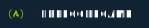

### Hola! 👋

Mi nombre es Raúl, soy desarrollador full stack

## 👾 Sobre mí

## 💬 Estoy por aquí

    
    
    

---

## 🛠️ Mis herramientas

### 👨‍💻 Lenguajes de programación

    
    
    
    
    
    
    
    
    
    

### 🧰 Frameworks y librerías

    
    
    
    
    
    
    

### 🗄️ Bases de datos y hosting

    
    
    
    

### 💻 Software y servidor personal

    
    
    
    
    
    
    
    
    
    
    

---

